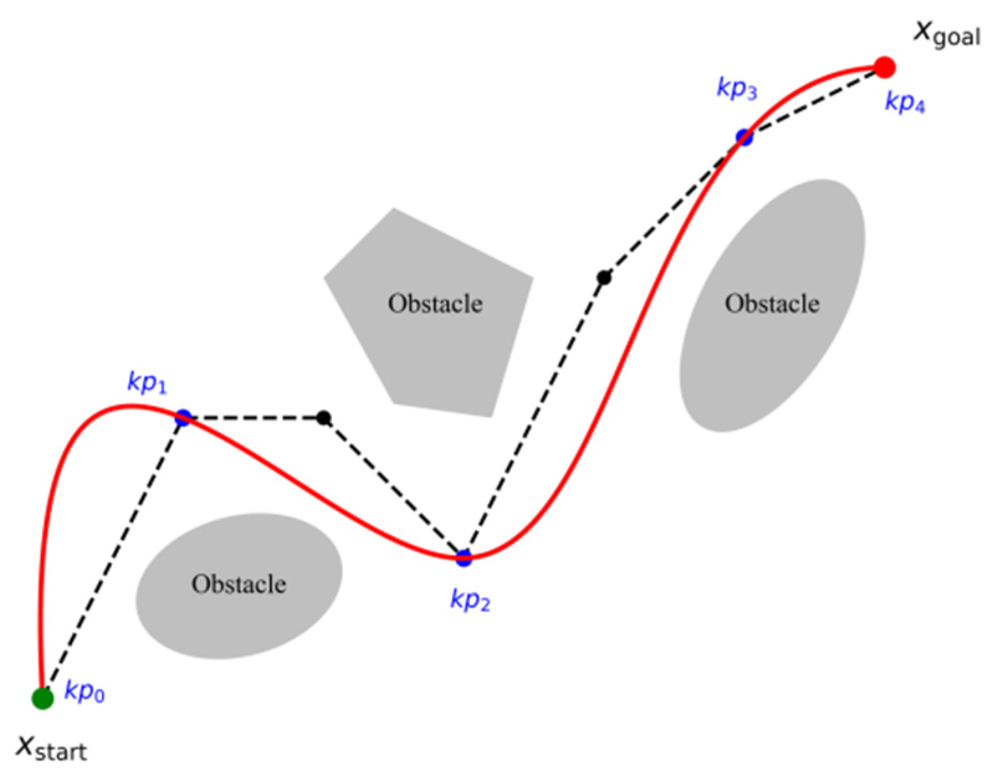

# Adaptive Spline Trajectory Planning with Simulated Annealing 
## 1.0 Introduction
The goal of this project was to develop a custom path and motion planner to drive along curved [spline] paths. This project achieves this with a TurtleBot3, navigating a maze and crowded spaces in the ROS2-Gazebo Sim Environment. **Each spline path is trained to adapt and conform to its environment to ensure robot safety when driving.**

## 2.0 Background
Our robot must navigate from a rest position to a target position. The environment is a PGM map, loaded from a Map Server node. The map is dilated and inflated to create a configuration space (c-space). The c-space is a discretized (vectorized) 2D graph; scaled to fit the continuous space the robot navigates. Each graph cell is either free or occupied by an obsticle or wall. Free spaces are places the robot can safely drive through. 

Trajectory planning involves (1) path planning and (2) motion planning. The first is handled with heuristics and an A-Star graph search on the c-space between where the robot starts and its target position. The result is a connected chain of edges between free cells in the c-space. Common path planners, such as Point-to-Point (P2P), then parse a path from those free cells. **However, common planners will follow the A-Star path closely to ensure robot safety. This becomes a problem for spline planners.**

Our robot creates paths to follow from quintic spline polynomials. Splines create organic and curved geomtric paths. These are excellent non-holonomic motion and smooth maneuvering. Our planner parses waypoints from an A-Star search to interpolate the spline path. 

<table>
    <tr>
        <td width="48%" valign="top" style="margin: 0; padding: 0;">
            

                d 
            

        </td>
        <td width="4%"></td>
        <td width="48%" style="margin: 0; padding: 0;">
            <figure style="margin: 0;">
                
                <figcaption><b>Figure 1:</b> <i>Illustrates spline path planning with obstacle avoidance. <a href="https://doi.org/10.3390/machines13080710">[1]</a></i></figcaption>
            </figure>
        </td>
    </tr>
</table>

## N.0 References 
[1] Sun, Z., Luo, Q., Zhang, Z., Peng, Y., Liu, Q., Zheng, S., & Liu, J. (2025). An Integrated Path Planning and Tracking Framework Based on Adaptive Heuristic JPS and B-Spline Optimization. Machines, 13(8), 710. https://doi.org/10.3390/machines13080710

