# Adaptive Spline Trajectory Planning with Simulated Annealing 
## 1.0 Introduction
The goal of this project was to develop a custom path and motion planner to drive along curved [spline] paths. This project achieves this with a TurtleBot3, navigating a maze and crowded spaces in the ROS2-Gazebo Sim Environment. **Each spline path is trained to adapt and conform to its environment for robot safety when driving.**

## 2.0 Background
Our robot must navigate from a rest position to a target position. The environment is a PGM map, loaded from a Map Server node. The map is dilated and inflated to create a configuration space (c-space). The c-space is a discretized (vectorized) 2D graph, scaled to fit the continuous space the robot navigates. Each graph cell is either free or occupied by an obstacle or wall. Free spaces are places the robot can safely drive through. 

Trajectory planning involves (1) path planning and (2) motion planning. The first is handled with heuristics and an A* graph search on the c-space between where the robot starts and its target position. The result is a connected chain of edges between free cells in the c-space. Common path planners, such as Point-to-Point (P2P), then parse a path from those free cells. However, common planners will follow the A* path closely to ensure robot safety. **This becomes a problem for spline planners.**

### 2.1 Project Motivation 
Our robot creates paths to follow from quintic spline polynomials. Splines create organic and curved geometric paths. These are excellent for non-holonomic motion and smooth maneuvering. Our planner parses waypoints from an A* search to interpolate the spline path. 

<table border="0" cellpadding="0" cellspacing="0" style="margin: 0; padding: 0; border: none; border-collapse: collapse;">
    <tr style="margin: 0; padding: 0; border: none;">
        <td width="48%" valign="top" style="margin: 0; padding: 0; border: none;">
            

                Splines take on several shapes and forms based on their curvature and the waypoints they interpolate. The A* search provides potential waypoints. But waypoints must be selectively chosen. As seen in <b>Figure 1</b>, a raw path is created from points connected by a dashed line, where the spline interpolates a subset of those points. 
            

            

                This becomes a balancing act. In our case, the A* path is the dashed line. Fewer waypoints means the spline path is smoother and can have larger maneuvers. But it may be unclear what shape that spline takes on, and if it risks colliding with an obstacle. Conversely, using more waypoints constrains the spline onto the A* path that will ensure it does not collide with obstacles. 
            

        </td>
        <td width="4%" style="border: none;"></td>
        <td width="48%" style="margin: 0; padding: 0; border: none;">
            

                
                <figcaption><b>Figure 1:</b> <i>Illustrates spline path planning. <a href="https://doi.org/10.3390/machines13080710">[1]</a></i></figcaption>
            

        </td>
    </tr>
</table>

### 2.2 Exploration-Exploitation Bottleneck on Splines and Safety 
If too many waypoints are chosen from the A* path, then A* will have more influence over the path geometry than the curvature of the splines created. The balancing act from before becomes a trajectory bottleneck. The curvature and geometric malleability of splines is minimized when the number of waypoints and safety are maximized. <b>Figure 1</b> shows this trade-off, in which every other waypoint is rejected. 
 
The spline path also follows the same homotopy as the original path. Viewing <b>Figure 1</b> from left to right, both the original and spline path travel over the first obstacle and weave under the second, and over the third in the same topological way. Although this allows for deterministic path planning, there are benefits to differing spline homotopy from the original path. For instance, consider if the spline in <b>Figure 1</b> could not pass through point `kp2`, and the spline instead traveled over (atop) the second obstacle from point `kp1` to `kp3`. **A spline path like that may turn out to be shorter or smoother.** 

But giving splines the ability to explore different homotopies from the original path brings back the bottleneck of exploring at the expense of safety; this is especially true in environments that can change. **Therefore, adaptive spline planning that avoids obstacles could reconcile exploration beyond A\* with safety.**

## 3.0 Motion Controls 
Trajectory planning involves (1) path planning and (2) motion planning. This section will briefly cover the motion planning. Motion planning is based on robot odometry and the spline path it follows. 

### 3.1 Motion Profiling with ICC
Given a path, the navigation node (`nav_node`) computes linear speeds. Linear speed is determined by acceleration and maximum-speed constraints. The linear speeds are calculated at each point along the discretized path by applying a trapezoidal motion profile. 

<table border="0" cellpadding="0" cellspacing="0" style="margin: 0; padding: 0; border: none; border-collapse: collapse;">
    <tr style="margin: 0; padding: 0; border: none;">
        <td width="48%" valign="top" style="margin: 0; padding: 0; border: none;">
            

                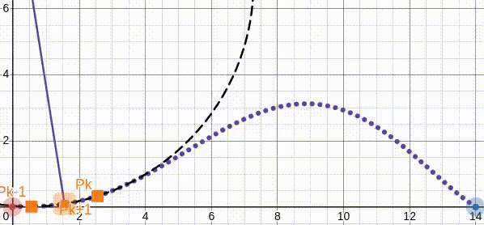
                <figcaption><b>Figure 2:</b> <i>Illustrates approximating angular motion from spline path. [A custom Desmos demonstration] <a href="https://www.desmos.com/calculator/e7bd339d19">[2] </a></figcaption>
            

        </td>
        <td width="4%" style="border: none;"></td>
        <td width="48%" valign="top" style="margin: 0; padding: 0; border: none;">
            

                As seen in <b>Figure 2</b>, a path is approximated as circular motion with the instantaneous center of curvature (ICC). The robot looks ahead and behind its current position to approximate the local curvature of the circle. 
            

            

                The instantaneous angular velocity is then calculated from both the ICC and the motion-profiled linear speed. This leaves a discretized vector of linear and angular speeds to describe instantaneous velocity along each point of the path. 
            
 
        </td>
    </tr>
</table>

This serves as an excellent feed-forward controller for both finding base wheel speeds and base linear/angular speeds for publishing to the `/cmd_vel` topic. 

### 3.2 Lateral PID Feedback Controller
The second half of motion is the feedback loop. Our robot uses a lateral PID controller that calculates error similarly to a Stanley controller. 

<table border="0" cellpadding="0" cellspacing="0" style="margin: 0; padding: 0; border: none; border-collapse: collapse;">
    <tr style="margin: 0; padding: 0; border: none;">
        <td width="48%" valign="top" style="margin: 0; padding: 0; border: none;">
            

                As seen in <b>Figure 3</b>, positional and heading errors are used to calculate speed adjustments at position <code>(cx,cy)</code> along the path. Position <code>(cx,cy)</code> is the point along the path closest to the robot.  
            

            

                Although our robot used a PID controller, the error was modeled similarly to Stanley. Our robot tracked its closest unvisited point along the path based on the <code>/odom</code> topic. This point was placed in the robot's reference frame to measure the perpendicular [lateral] offset between it and the robot. This metric was an error for the PID controller that outputs a differential angular speed. 
            

        </td>
        <td width="4%" style="border: none;"></td>
        <td width="48%" style="margin: 0; padding: 0; border: none;">
            

                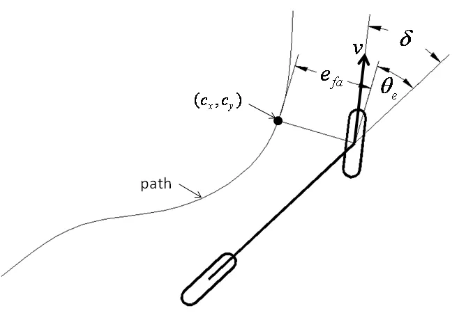
                <figcaption><b>Figure 3:</b> <i>Illustrates error calculation for a Stanley Feedback Controller. <a href="https://medium.com/roboquest/understanding-geometric-path-tracking-algorithms-stanley-controller-25da17bcc219">[3]</a></i></figcaption>
            

        </td>
    </tr>
</table>

Then, the motion profile computes wheel speeds for each point along the path before caching them. The closest unvisited point along the path both dictates what base speed is pulled from the cache in addition to the differential speed offset for drift correction. Together, the robot successfully followed spline paths.

## 4.0 Intelligent and Adaptive Splines 
The remainder of this document covers the custom approach to adaptive spline planning. This section covers how splines can act as intelligent agents that adapt to avoid obstacles in the environment. **This is the central contribution of this project**. All work is implemented with NumPy. 

### 4.1 Quintic Splines  
Each path is made up of parametric quintic polynomials based on an input **t** with domain [0,1]. This function maps **t** → **(x,y)**. A path is a set of poses **(x,y,θ)**. A single spline interpolates between one pose to the next. If spline **S** interpolates from pose **P** to pose **P`**, then functions **x(t)** and **y(t)** take the form: 

    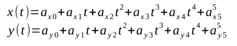
    <figcaption style="text-align: center;"><b>Equation 1:</b> <i>Models quintic spline S(t).</i></figcaption>

Both functions' coefficients are solved for with a time-parameter matrix as the Boundary Value Problem. The result is a spline **S(t) = (x(t), y(t))**, and its first and second derivatives, computed via Horner's method. This is implemented in the `Quintic` class in `quintic.py`. Finally, our robot computes splines relatively between poses. 

### 4.2 Cost-Optimization Problem and the K-Space
The spline exploration-to-safety bottleneck mentioned before is an optimization problem. Obstacle avoidance can be quantified in a cost metric in terms of spline parameters. These parameters then can be tuned by descending the cost map. 

Solving for quintic spline coefficients requires knowing variables: **x0, y0, θ0, x1, y1, θ1, k0,** and **k1**. The first six are provided by the two poses the spline interpolates. The **k0** and **k1** are independent curvature constants to be set separately. **k0 and k1 are denoted as the 2D k-space**.  

<table border="0" cellpadding="0" cellspacing="0" style="margin: 0; padding: 0; border: none; border-collapse: collapse;">
    <tr style="margin: 0; padding: 0; border: none;">
        <td width="48%" valign="top" style="margin: 0; padding: 0; border: none;">
            

                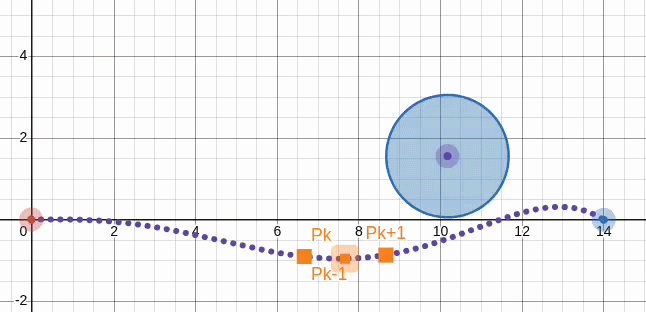
                <figcaption><b>Figure 4:</b> <i>Illustrates a spline traversing the k-space. [A custom Desmos demonstration] <a href="https://www.desmos.com/calculator/hlemwknsxi">[4] </a></figcaption>
            

        </td>
        <td width="4%" style="border: none;"></td>
        <td width="48%" valign="top" style="margin: 0; padding: 0; border: none;">
            

                As seen in <b>Figure 4</b>, a spline is shown changing its curvature and shape based on the values for <b>(k0, k1)</b>. A subset of this k-space has the spline go over the blue circular obstacle, and another subset goes under the obstacle. 
            

            

                Our robot quantifies cost as overlap with known obstacles. This cost is minimized for obstacle avoidance. 
            

        </td>
    </tr>
</table>

### 4.3 Defining the Cost Function
A spline can be adaptive by avoiding obstacles in its environment. This requires quantifying spline overlap with a set of obstacles. Potential solutions for a spline are candidate splines with an optimal **(k0,k1)**. However, optimal splines must also minimize acceleration and arc length to ensure safe and controlled motion when driving. 
 
 #### 4.3.1 Outlining the Cost Function 

    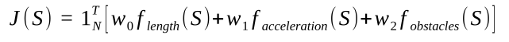
    <figcaption style="text-align: center;"><b>Equation 2:</b> <i>Models the cost function J(S) for spline optimization.</i></figcaption>

The cost function in **Equation 2** is a linear combination of sub-costs for arc length, acceleration, and obstacle overlap. Each sub-cost term **f(S)** is tuned by a corresponding scalar weight. Each sub-cost term **f(S)** returns an **Nx1** vector of costs calculated at each **N** points interpolated along the spline. The sub-cost linear combination is summed and transformed against a ones row vector with shape **1xN**.

The result is a vector that evaluates cost at every point along the spline. The row costs are then summed as a final scalar cost for **J(S)**.

<table border="0" cellpadding="0" cellspacing="0" style="margin: 0; padding: 0; border: none; border-collapse: collapse;">
    <tr style="margin: 0; padding: 0; border: none;">
        <td width="48%" valign="top" style="margin: 0; padding: 0; border: none;">
            

                However, the spline arc length and acceleration are approximated in <b>Equation 3</b>. Treating both as costs incentivizes short and smoother splines when optimizing. These approximations hold because both terms in this approximate form, or exact form, will trend the same when minimizing cost. 
            

            

                <b>Equation 3</b> also shows that obstacle avoidance cost is weighted much higher than arc length and acceleration costs. 
            

        </td>
        <td width="4%" style="border: none;"></td>
        <td width="48%" valign="top" style="margin: 0; padding: 0; border: none;">
            

                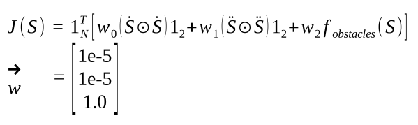
                <figcaption><b>Equation 3:</b> <i>Models J(S) with sub-costs and hyper parameters.</figcaption>
            

        </td>
    </tr>
</table>

This ensures no one sub-cost **f(S)** overpowers the rest, but biases toward obstacle avoidance so the path avoids intersecting walls and obstacles. **This is the safety guarantee for our trajectory planner.** 

#### 4.3.2 Outlining the Obstacle Cost 
The subsection above outlines the cost function. This subsection describes in detail how the obstacle sub cost is calculated. Obstacle cost requires measuring the collision distance between the robot and each obstacle.  

<table border="0" cellpadding="0" cellspacing="0" style="margin: 0; padding: 0; border: none; border-collapse: collapse;">
    <tr style="margin: 0; padding: 0; border: none;">
        <td width="48%" valign="top" style="margin: 0; padding: 0; border: none;">
            

                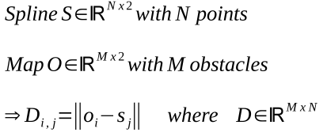
                <figcaption><b>Equation 4:</b> <i>Models MxN matrix D; permutes sets S and O to compute D.</i></figcaption>
            

        </td>
        <td width="4%" style="border: none;"></td>
        <td width="48%" valign="top" style="margin: 0; padding: 0; border: none;">
            

                This starts with defining spline <b>S</b> and obstacle set <b>O</b> as matrices with shape Nx2 and Mx2, respectively. As seen in <b>Equation 4</b>, each row is a point in 2D space for both matrices <b>S</b> and <b>O</b>.  
            

            

                Also notated in <b>Equation 4</b>, matrix <b>D</b> with shape MxN represents the distance between all N spline points and M obstacles. The <b>D_ij</b> notates the element-wise calculation for distance across matrix <b>D</b>.
            

        </td>
    </tr>
</table>

From this distance matrix **D**, distances below a threshold are considered collisions. This is best notated by a radial threshold from each obstacle in matrix **O**. As a result, the cost function punishment scales with how much of the spline overlaps with obstacles. 

    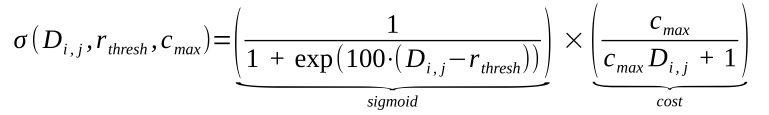
    <figcaption style="text-align: center;"><b>Equation 5:</b> <i>Models the obstacle cost activation function.</i></figcaption>

To achieve this radial filtering, matrix **D** is passed into the activation function modeled in **Equation 5**. The activation function is an element-wise operation on each element **D_ij**. This function is the product of a sigmoid step function and inverse distance function. 

The sigmoid serves as a steep continuous step function that collapses to zero for all distances **D_ij** greater than **r_thresh**. The sigmoid converges to one for distances below the threshold. This sigmoid is multiplied by a clamped inverse distance cost, as seen in **Equation 5**. The inverse distance is maximized at **D_ij=0** with max output **c_max**. Between the sigmoid and inverse distance, the result is decaying costs for larger distances such that cost collapses to zero beyond a threshold radius.   

<table border="0" cellpadding="0" cellspacing="0" style="margin: 0; padding: 0; border: none; border-collapse: collapse;">
    <tr style="margin: 0; padding: 0; border: none;">
        <td width="48%" valign="top" style="margin: 0; padding: 0; border: none;">
            

                This work then culminates in <b>Equation 6</b>. The activation function with shape MxN is multiplied by an upper-triangular NxN matrix <b>U_N</b>. This applies a cumulative sum operation across the columns of the activation function in <b>Equation 5</b>. 
            

        </td>
        <td width="4%" style="border: none;"></td>
        <td width="48%" valign="top" style="margin: 0; padding: 0; border: none;">
            

                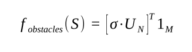
                <figcaption><b>Equation 6:</b> <i>Models the final obstacle cost.</i></figcaption>
            

        </td>
    </tr>
</table>

Multiplying the activation function by the upper-triangular matrix yields another MxN matrix. Each column represents a single point of N points along the spline **S**. Each row represents the sub-cost contributed by each M obstacles from set **O**. The cumulative summation carries past obstacle costs from previous columns into later columns. This forces obstacle costs to compound if a spline clips through a wall while punishing harder for earlier collisions on the path. **As a result, later points along a path "remember" past collisions and act as a deterrent against greedy bias during optimization.** 

A final transpose and transformation against a Mx1 ones vector sums all compounded obstacle cost at each point along the path. The result is a sub-cost vector for obstacle cost that is denoted in **Equation 6**. 

**Obstacles are then retrieved from the PGM map, published by the Map Server node. Obstacles are given a radius 1.5 times the map resolution.** This radius serves as a c-space dilation when optimizing for the spline k0 and k1 coefficients. 

### 4.4 Optimizing Splines with Simulated Annealing 
Now with an established cost function, this subsection analyzes the cost map and optimization process for tuning splines. This begins with viewing the cost map. 

<table border="0" cellpadding="0" cellspacing="0" style="margin: 0; padding: 0; border: none; border-collapse: collapse;">
    <tr style="margin: 0; padding: 0; border: none;">
        <td width="35%" valign="top" style="margin: 0; padding: 0; border: none;">
            

                As seen in <b>Figure 5</b>, a cost map is generated for interpolating a spline between a set of obstacles. The surface represents the (k0,k1) k-space; the height the cost. The red plane has a slope in the direction of "best guess" global minimums; it is regressed from an initial sampling of the k-space. 
            

            

                This graph illustrates how the cost map is a non-convex surface. Considering the k-space maps to the cost surface continuously, splines fall into different homotopy classes based on whether they travel over or under an obstacle. <b>Class count scales exponentially with more obstacles to travel around.</b> 
            

        </td>
        <td width="4%" style="border: none;"></td>
        <td width="48%" valign="top" style="margin: 0; padding: 0; border: none;">
            

                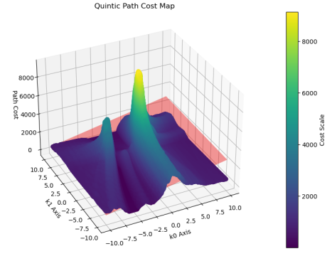
                <figcaption><b>Figure 5:</b> <i>Illustrates the cost map for a spline S(t).</i></figcaption>
            

        </td>
    </tr>
</table>

Recalling **Figure 4**, the stationary spline can transform by traversing the k-space; to test different combinations of **(k0,k1)**. If the spline in **Figure 4** travels over the obstacle, the only topological way to get that spline to travel under the obstacle instead is by traveling through it in the k-space. This stands to reason that the non-convex cost map will be riddled with steep ridges in the k-space where there are obstacle collisions in the c-space. Then between these ridges, local minimum valleys will be difficult to distinguish from absolute minimums. Given this is what is observed in **Figure 5**, simulated annealing is the chosen optimizer algorithm when seeding the search at (k0,k1)=(0,0). 

### 4.5 Initial Tests 
The last couple of subsections defined a cost function and an optimizer to minimize that cost by choosing an optimal **(k0,k1)** from the k-space. Before testing in a Gazebo-RViz environment, this apparatus is tested below. 

<table border="0" cellpadding="0" cellspacing="0" style="margin: 0; padding: 0; border: none; border-collapse: collapse;">
    <tr style="margin: 0; padding: 0; border: none;">
        <td width="36%" valign="top" style="margin: 0; padding: 0; border: none;">
            <figcaption style="text-align: center"><b><i>Optimizer Test A</i></b></figcaption>
            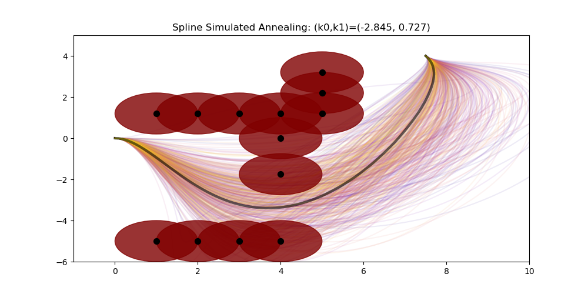
        </td>
        <td width="2%" style="border: none;"></td>
        <td width="36%" valign="top" style="margin: 0; padding: 0; border: none;">
            <figcaption style="text-align: center"><b><i>Optimizer Test B</i></b></figcaption>
            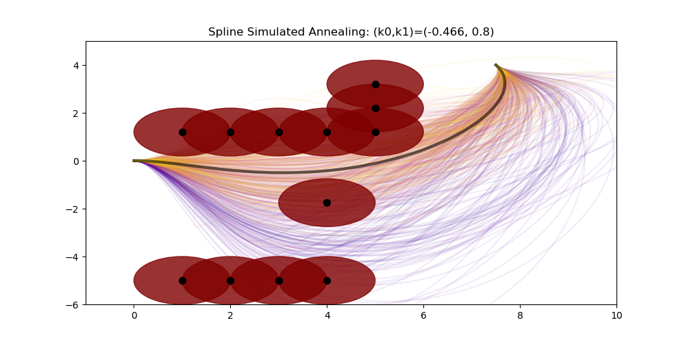
        </td>
    </tr>
    <tr style="margin: 0; padding: 0; border: none;">
        <td width="36%" valign="top" style="margin: 0; padding: 0; border: none;">
            <figcaption style="text-align: center"><b><i>Optimizer Test C</i></b></figcaption>
            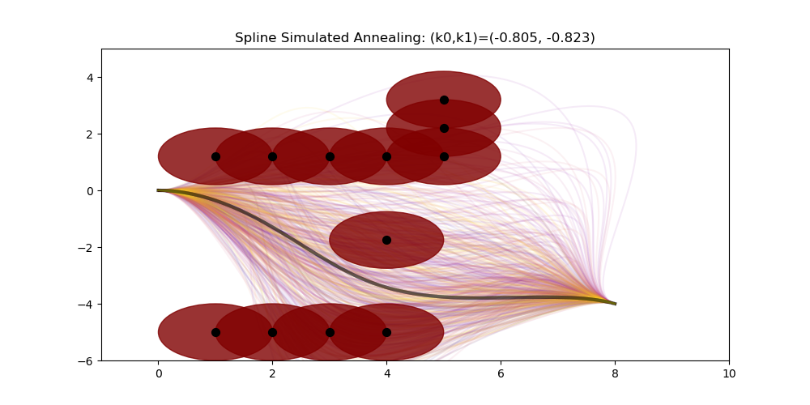
        </td>
        <td width="2%" style="border: none;"></td>
        <td width="36%" valign="top" style="margin: 0; padding: 0; border: none;">
            <figcaption style="text-align: center"><b><i>Optimizer Test D</i></b></figcaption>
            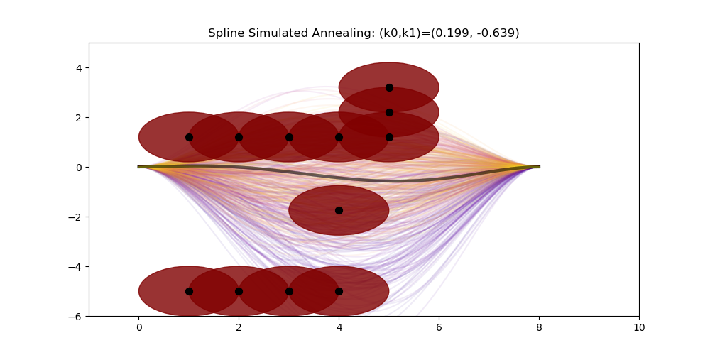
        </td>
    </tr>
</table>

    <figcaption style="text-align: center"><b>Figures 6-9:</b> <i>Illustrates spline adaptation to environment with simulated annealing.</i></figcaption>

 

As seen in **Figures 6-9**, the simulated annealing optimizer is tasked with traversing the k-space to find optimal **(k0,k1)**. Red circles represent obstacles belonging to set **O**. Points along the spline, when discretized, belong to set **S**. During training, the **(k0, k1)** curvature is set, spline coefficients are calculated analytically, the spline is interpolated, and then the cost is computed. This repeats for every epoch computed in the k-space. **This is highly expedited by implementing the cost function and spline coefficients with NumPy operator broadcasting**. Earlier epochs show splines drawn in purple, and more tuned later epochs show splines converging with a yellow color. 

Viewing tests A and B, the initial and final waypoints and poses are the same. **Test A shows** how the spline completes a round-about the walls of obstacles. **Test B shows** how the earlier epochs explore possible openings in the wall of obstacles; the spline chooses the one that minimizes its arc length in later epochs. This is solidified in the final black spline. 

Additionally, **Test C shows** how changing the final waypoint's pose to being placed further south still results in the optimizer finding an optimal spline. **Test D also shows** this by exploring both openings to its final pose, and choosing the more northern opening that minimizes arc length and curvature.  

<table border="0" cellpadding="0" cellspacing="0" style="margin: 0; padding: 0; border: none; border-collapse: collapse;">
    <tr style="margin: 0; padding: 0; border: none;">
        <td width="36%" valign="top" style="margin: 0; padding: 0; border: none;">
            <figcaption style="text-align: center"><b><i>Optimizer Test E</i></b></figcaption>
            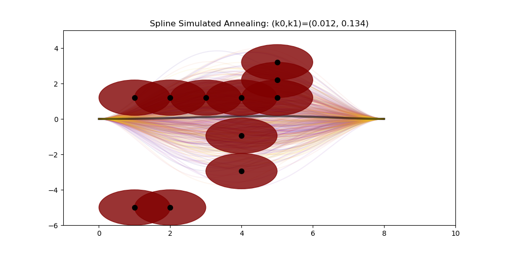
        </td>
        <td width="2%" style="border: none;"></td>
        <td width="36%" valign="top" style="margin: 0; padding: 0; border: none;">
            <figcaption style="text-align: center"><b><i>Optimizer Test F</i></b></figcaption>
            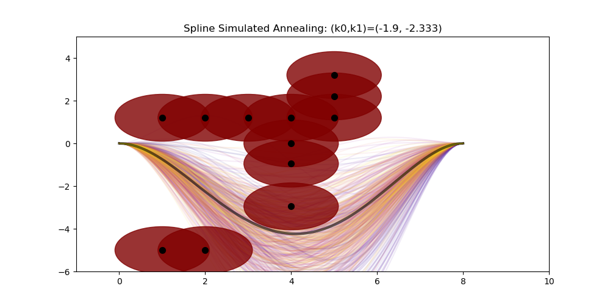
        </td>
    </tr>
</table>

    <figcaption style="text-align: center"><b>Figures 10-11:</b> <i>Illustrates the leaky obstacles problem.</i></figcaption>

 

However, although the optimizer converges well on splines that adapt to their environment, there are edge cases. The biggest is the **leaky obstacle problem**. As seen in **Figures 10-11**, an obstacle can leave a slight opening, demonstrated in **test E**. The optimal spline in test E may be impractical. 

But, if the obstacles are modeled based on the c-space, the obstacle radius cannot make obstacles tangent at their perimeters. The optimizer can find solutions that squeeze between c-space occupied cells similarly to in test E. However, once this leaky crevice is patched in **test F**, the optimizer correctly finds the truly optimal spline. 

This exercise is the reason why the obstacle radius is 1.5 times that of the map cell resolution. Because when occupied cells are mapped as obstacles, this radius forces obstacle regions to overlap and plug any leaks in the cost map. 

Lastly, recalling section 4.4, the number of ridges on the cost can scale exponentially with the number of homotopy classes of splines. **The number of classes, and convergence time, can be minimized for large sets of obstacles by plugging these leaks.** 

## 5.0 Trajectory Planning Package Pipeline
Given our functional adaptive splines and optimizer, this section will outline how it is used in ROS2. To recall, a TurtleBot3 navigates a PGM map that is published by a Map Server node. The subsections below describe further.

### 5.1 Waypoint Parsing 
Once in RViz, the user can use the Goal Pose feature. The `nav_node` subscribes to this topic and receives a goal pose. An A* search is run to find a valid path from the robot to this pose. 
<table border="0" cellpadding="0" cellspacing="0" style="margin: 0; padding: 0; border: none; border-collapse: collapse;">
    <tr style="margin: 0; padding: 0; border: none;">
        <td width="48%" valign="top" style="margin: 0; padding: 0; border: none;">
            

                As seen in <b>Figure 12</b>, the robot sits at rest at the bottom left of the figure. Meanwhile a goal pose is centered on the map. The A* path is found and visualized as the brown occupancy grid. 
            

            

                Given the A* path, corners are detected where path direction changes. These are parsed and the rest of the path is filtered out. Waypoints are placed at the midpoints between these corners. Each midpoint points in a cardinal direction; this is illustrated by the blue arrow in <b>Figure 12</b>. The average between the current and next waypoint defines its heading. 
            

        </td>
        <td width="4%" style="border: none;"></td>
        <td width="48%" valign="top" style="margin: 0; padding: 0; border: none;">
            

                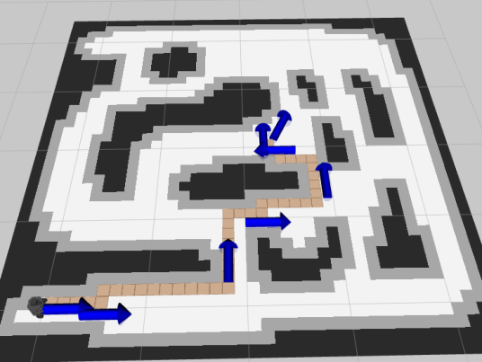
                <figcaption><b>Figure 12:</b> <i>Illustrates the A* search for waypoints.</i></figcaption>
            

        </td>
    </tr>
</table>

Finally, the local c-space at each waypoint is placed in a kernel such that occupied cells are filtered out. A centroid is calculated in the local free space in that kernel. <b>This snaps waypoints to local centroids to address the "wall hugging" symptom of A* heuristics.</b> 

### 5.2 Waypoint Dropout 
Once the initial waypoints are parsed by the `nav_node`, the waypoints are placed in a `nav_msgs/Path` instance; it is then sent over a service request to the `spline_node`. The spline node initiates by creating and optimizing splines between each of the waypoints. 

    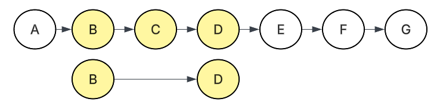
    <figcaption style="text-align: center;"><b>Figure 13:</b> <i>Illustrates calculating dropout of waypoint C.</i></figcaption>

As seen in **Figure 13**, each node is a waypoint such that edges are optimized splines that connect them. Waypoint dropout begins by moving a three-node slider down the list of waypoints. In the illustration, the sum cost from spline **BC** to **CD** is compared to the potential spline **BD**. Spline **BD** is created and optimized. Waypoint **C** is dropped from the list if the cost of **BD** is less than or equal to a percent difference compared to the sum cost of **BC-CD**. 

The dropout slider traverses down the list of waypoints while making these greedy cost comparisons. If dropping a waypoint detrimentally affects a path (i.e. intersecting an obstacle) the cost of the comparative spline will be noticeably larger. This percent difference filter between **BC-CD** compared to **BD** ensures that dropping waypoint **C** does not compromise the path. 

Dropout continues either until a certain number of waypoints are dropped, or until no waypoints are able to be dropped. **Any new splines created in this process are memoized after they are optimized; all known splines are cached.**

### 5.3 Final Heading Tuning
The final task of the `spline_node` is the tuning of the final heading at the goal pose. Once dropout is complete, the final waypoint [where the goal pose is] has its heading adjusted. An upper and lower [counter clockwise and clockwise] heading is offset from the base heading by a set bound value. A binary search starts by comparing the cost of the base spline to the other two. 

The spline with a heading with the lowest cost is set as the new base spline. The bound value is divided by the epoch. Epochs increment for each comparison. After 2-5 epochs, the binary search adjusts the heading of the final waypoint while caching its interpolated path. 

The original A* path may have reached the goal pose while pushing up against a wall. If the final waypoint sets its heading to that of the final A* cell, the final spline too may end up squished against the wall. Final heading tuning is used to handle this. 

### 5.4 Driving the Path
Once dropout and final heading tuning is complete, the full spline path is reconstructed and sent back to `nav_node` from `spline_node` as the service response. The `nav_node` then applies a trapezoidal motion profile with a PID feedback controller as illustrated in section 3.0. 

## 6.0 Results 
This all culminates in a TurtleBot3 driving along adaptive splines to navigate to a set goal pose in the Gazebo-RViz Sim Environment. This is seen below.

    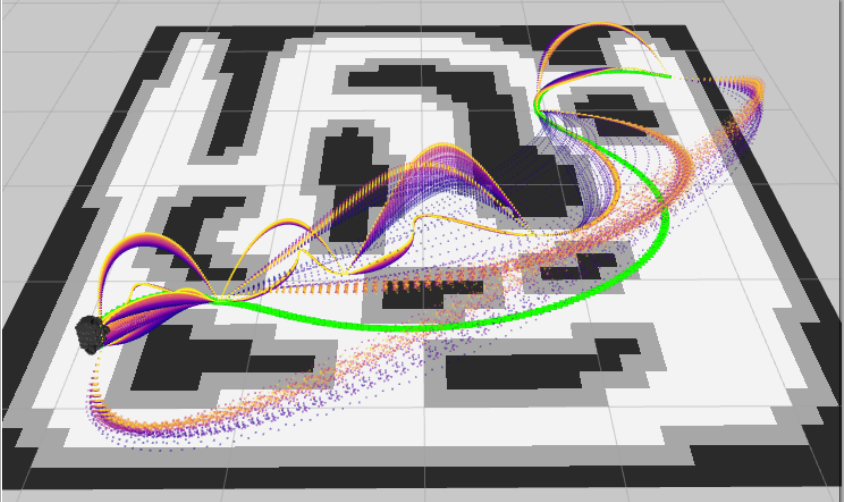
    <figcaption style="text-align: center;"><b>Figure 14:</b> <i>RViz2 screenshot of trajectory planning.</i></figcaption>

Shown in **Figure 14**, the robot began its navigation in the top right of the map and ended at the bottom left goal pose. The green path of grid cells represents the path taken. **The point clouds visualize how each spline was optimized.** Each colored arc was a spline considered and optimized. Fanned arcs that **are on** the ground show how each spline converged onto yellow splines from purple splines. 

**Figure 14** also shows some optimized splines visualized as rising above the map in arcs. **Spline tuning that is projected in the Z-axis represent successful waypoint dropouts**. 

It can be seen how the overall path initially intersected the map center. At the center, there was a sharp turn that was unnecessary. The dropout process removed these center waypoints and smoothed the path. This occurred four times in **Figure 14**. 

Eventually, the dropout process began comparing top-right waypoints to bottom left ones. **A final path was found that circumvented the entire map center in one large smooth arc.** This final path followed the initial A* and initial splines, but was able to explore enough to discover a more optimal path that avoids obstacles and the map center.

    
    <figcaption style="text-align: center;"><b>Figure 15:</b> <i>RViz2 video of trajectory planning and driving.</i></figcaption>

## 7.0 Conclusion

## 8.0 References 
[[1]](https://doi.org/10.3390/machines13080710) Sun, Z., Luo, Q., Zhang, Z., Peng, Y., Liu, Q., Zheng, S., & Liu, J. (2025). An Integrated Path Planning and Tracking Framework Based on Adaptive Heuristic JPS and B-Spline Optimization. Machines, 13(8), 710. [https://doi.org/10.3390/machines13080710](https://doi.org/10.3390/machines13080710)

[[2]](https://www.desmos.com/calculator/e7bd339d19) Papesh, M. (2026, June 12). Quintic spline demonstration. Desmos.com; Desmos. [https://www.desmos.com/calculator/e7bd339d19](https://www.desmos.com/calculator/e7bd339d19)

[[3]](https://medium.com/roboquest/understanding-geometric-path-tracking-algorithms-stanley-controller-25da17bcc219) Kundu, S. (2020, July 19). Understanding Geometric Path Tracking Algorithms — Stanley Controller. Roboquest. [https://medium.com/roboquest/understanding-geometric-path-tracking-algorithms-stanley-controller-25da17bcc219](https://medium.com/roboquest/understanding-geometric-path-tracking-algorithms-stanley-controller-25da17bcc219)

‌
[[4]](https://www.desmos.com/calculator/hlemwknsxi) Papesh, M. (2026, June 15). Spline k-space demonstration. Desmos.com; Desmos. [https://www.desmos.com/calculator/hlemwknsxi](https://www.desmos.com/calculator/hlemwknsxi)  
